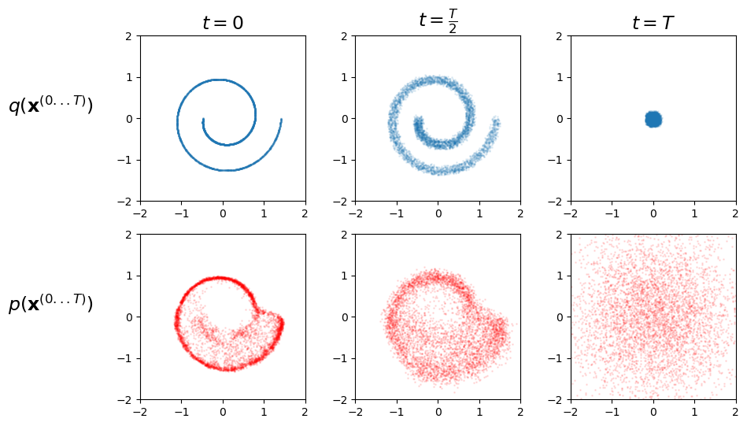

# diffusionPractice
### hands on diffusion process

One of the main goals of my internship at PMU was to study the application of diffusion processes in detection tasks. To achieve this, I had to familiarize myself with diffusion processes, their primary applications, and how to implement them. Here are the workshop materials and test codes I developed alongside learning the theory.

### results on the helloWorldDiffusion code

  

